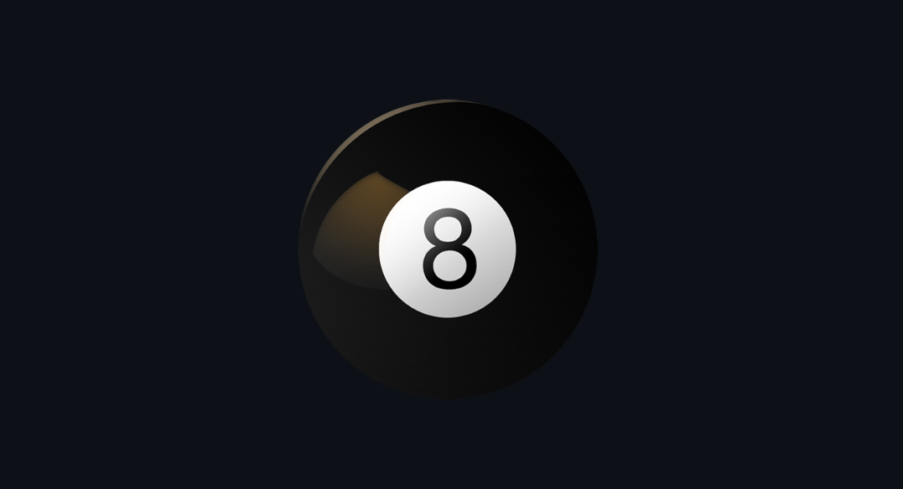
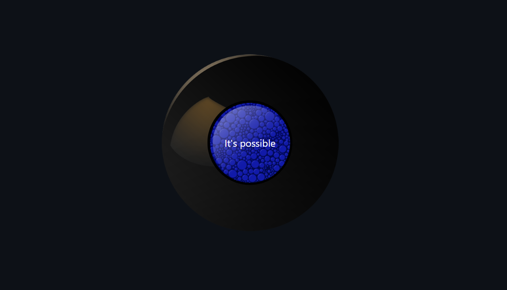
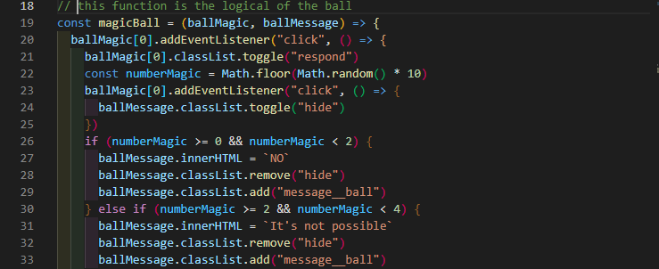

 <h1 style="text-align:center;">The magic Ball<h1>

It's a simple JS project that emulates a classic Magic Ball 8 game.    Where you answer with a simple answer , for example "No", "Yes", "Probably" is fun.  
to play, you think of a question and click on the ball, in a moment it shows a message with your answer

## Goodluck 
> to edit the responses you can go to js/main.js and change the response of the magicBall function

> In this part you can change the answers

_Thanks for watching._
